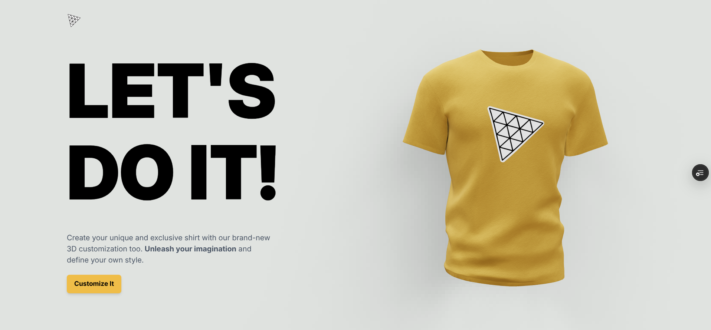
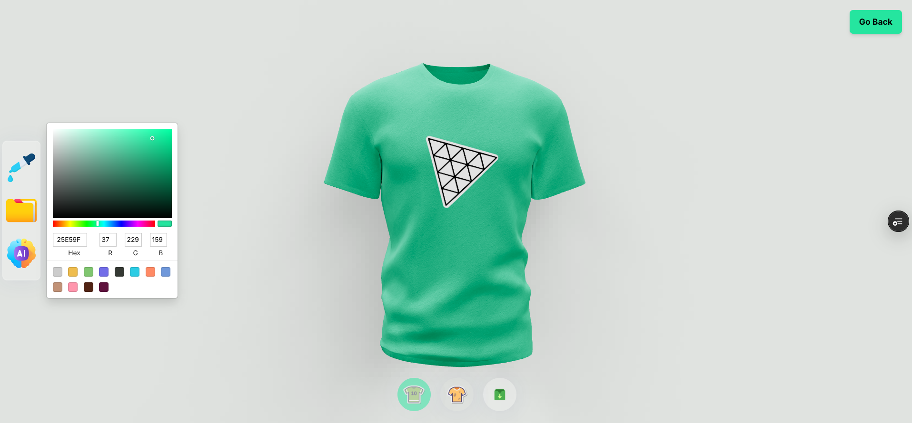

# Shirty 👕

An interactive 3D shirt customization web application that allows users to personalize shirt colors and apply AI-generated logos in real time.

---

## 🚀 Live Demo

🔗 [Visit Shirty](https://shirty-seven.vercel.app/)

---

## 📸 Preview

<table align="center">
  <tr>
    <td align="center">
      
    </td>
    <td align="center">
      
    </td>
  </tr>
</table>

---

## ✨ Features

- 🎨 Real-time 3D shirt color customization
- 🖼️ File picker for custom logo uploads
- 🤖 AI-powered logo generation (DALL·E integration ready)
- ⚡ Smooth 3D rendering with Three.js
- 📱 Fully responsive across devices
- 🔗 Backend API integration for AI image processing

> Note: The AI logo generation feature is currently disabled due to billing limitations, but the full backend integration is implemented and ready.

---

## 🛠 Tech Stack

- React.js
- Tailwind CSS
- JavaScript
- Three.js
- Node.js
- Express.js
- OpenAI DALL·E API

---

## ⚙️ Installation & Setup

Clone the repository:

```bash
git clone https://github.com/your-username/shirty.git
cd shirty
```

### Start the Client

```bash
cd client
npm install
npm run dev
```

Client Runs on: http://localhost:5173

### Start the Server

```bash
cd server
npm install
npm start
```

Server Runs on: http://localhost:8080

> Note: You can change the server port inside the configuration if needed.
